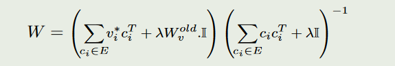

### 一、修改的部分
修改了`pipeline_videogen.py`和`latte_t2v.py`增加了方法`get_sentence_embedding`,获取要获得的embedding。

在`new_edit.py`通过

```
def get_prompt_embedding(videogen_pipeline, prompt):
    encoder_hidden_state, encoder_hidden_state_mask = videogen_pipeline.get_sentence_embedding(prompt, 
                        video_length=16, 
                        height=512, 
                        width=512, 
                        num_inference_steps=4,
                        guidance_scale=7.5,
                        enable_temporal_attentions=True,
                        num_images_per_prompt=1,
                        mask_feature=True,
                        enable_vae_temporal_decoder=False
                        )
    return encoder_hidden_state[16,:,:]
```

    最后取第一维的第16行作为embedding的代表，因为前面的维度我发现不管如何编码，不同句子都是一样的。从16维开始有不同

### 二、参考的函数

最后优化的函数还是这个，但是不确定这个方向是否能有效擦除。

### 三、运行
`new_edit.ipynb`修改注意力权重

这里可以修改`lamb`，`erase_scale = 0.3`参数

结果是`lattet2v_model2.pt`

`bash sample/t2v.sh`可以用新的权重生成视频，配置文件在`configs/t2v`里面